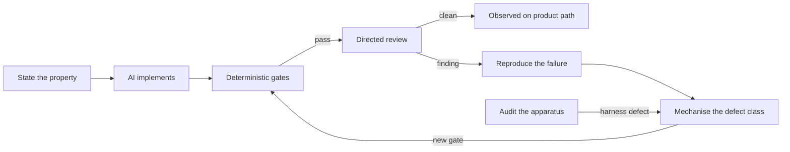

AI makes code cheap to produce. It does not make code cheap to trust. On
SGR A\*, a browser-based black-hole simulation and sonification system built
largely with frontier AI models, the bottleneck moved from implementation to
assurance.

The project combined numerical simulation, several physics models, real-time
interaction, accessibility, sonification and a large validation apparatus. Over
thirteen audit lineages between July and September 2026, three findings kept
recurring:

1. **A green result is evidence only for what it exercised.** Several times, a
   passing suite was running something other than the shipped system.
2. **Assurance mechanisms need to be orthogonal.** AI review, conventional
   tools, behavioural execution and audits of the test apparatus each caught
   defects the others missed.
3. **Some properties resist assertion.** Where a test can only check a proxy,
   the stronger move is often to make the wrong code impossible to write.

The response that worked was conventional engineering, applied deliberately:
explicit ownership, stated acceptance properties, instrumentation, reproduction,
and turning each repeatable defect class into a gate. This paper sets out that
evidence and the playbook I would carry into another team.

---

# Evidence at a glance

Every row records what was green at the code state where the defect was found,
not at closure. Post-fix figures sit in their own column.

| Code state | Area | Green at the time | What the audit found | After repair |
|---|---|---|---|---|
| V1, 29 Sep, final baseline (`815bc8a`) | Followed-body forecast | Several performance reviews, some broad | Following an existing body cloned the system and integrated it forward on the main thread (~750 ms refresh, ~200 ms within 500 AU) only to draw a future path no V1 requirement called for; S2 recompute 16.7 ms median, 40.2 ms max | Removed; launch preview kept; authoritative state bit-identical; release smoke-tested |
| V1, 24 Sep review (HEAD) | Desktop drawers | Containment test passed | New 462-check sweep: 238 checks failed | 0 of 462 failed |
| V1, 24 Sep review (HEAD) | Mode-switch focus | axe 0, Pa11y 0 | Every mode switch dropped keyboard focus; the dynamic accessibility test never switched mode | Reconciled 25 Sep |
| V1, 24 Sep review (HEAD) | Accessibility harness | Always exited 0 | Recorded PASS before counting violations; never reached one named state | Harness patched |
| V1, 24 Sep review | Central-body identity | Scenario loader accepted input | A reordered scenario could pin an ordinary star as central while Sgr A\* sat elsewhere | Single resolver in V2 integration |
| V1, 22 Sep clean-room audit | Runtime crashes | Earlier AI-directed review | ESLint `no-undef` flags exactly the three undefined identifiers behind the crashes | Standard lint check |
| 13 Sep reaudit (`a86ae13`) | Body interaction | Existing gates | In GR-on mode, `BLOCK` used one end half-kick; `physicsStep` used a three-iteration fixed point | Loops made identical; 10-orbit ratio 1.00 across modes |
| 9 Sep harness audit | KerrGeoPy oracle | Oracle-backed gates | Dependency identity unchecked; 10 checkpoints wrong, silently | Skips made explicit; not proof of full oracle execution |
| Pre-HCI, 26 Aug deep audit | Kerr product path | 14 tranche gate files | Evidence came from adaptive DP5(4); the product shipped fixed-step RK4 | Product moved to bounded adaptive DP5(4); strong-field tolerance ratification provisional |
| Pre-HCI, 26 Aug deep audit | Duplicated DP5(4) | Tranche evidence frozen | Bench (oracle) copy overshot its endpoint 1000x in a synthetic case; shipped copy correct | Instance closed; no single-implementation guard |
| Pre-HCI, 26 Aug deep audit | Release runner | Release suite green | 12 gate files outside the `*.test.mjs` glob, including one red gate | Inventory-driven discovery: 92/92 files, 671/671 tests (`a44cd30`) |
| Pre-HCI, 26 Aug deep audit | Frozen-evidence gate | Gate present | Regenerated its artefacts before hashing them | **Still open:** five mutations at later reconciliation |
| Pre-HCI, 26 Aug deep audit | Timestep cost | — | `pickDt` cost 2.6–5x `computeAccel`, flat across body counts | 3.7x on `pickDt`, 1.9x end-to-end, identical physics |
| 19 Aug independent audit | Headless loader | Harness in routine use | Loader continued silently when a module file was absent | Parity infrastructure added; closure not established |
| 19 Aug independent audit | Performance harness | Harness in routine use | `vm` harness inflated physics cost 8.8–18.4x, non-uniformly | Non-`vm` measurement loader |

---

# 1. A passing test proves only what it exercised

The desktop drawer containment test passed at HEAD while drawers visibly
overflowed the screen. The test was not broken. It tested less than its name
claimed.

Its smallest viewport was 1280 pixels, but the desktop layout starts at 721, and
the overflow sat between 721 and 1100. It checked only the default Explore mode.
It never asked whether an open drawer covered the controls beneath it.

The audit wrote a stricter sweep instead: 33 viewport sizes, both modes, seven
checks each, 462 in total. At HEAD, 238 checks failed. The root cause was that an
earlier AI-generated fix had constrained each drawer's size but never its
position. After the layout repair, 0 of 462 failed.

The lesson is not "write more tests". It is to state the property that matters,
then check that the test observes it wherever it matters. Here the property was
not "a drawer has a maximum width" but:

> Every control stays visible, reachable and unobscured across every supported
> desktop size and mode.

---

# 2. Validate the path, not the algorithm

The strongest-looking evidence in the project validated code the product did not
run. Fourteen Kerr tranche gate files exercised an adaptive, error-controlled
Dormand–Prince DP5(4) integrator. The shipping runtime adapter used its own
fixed-step RK4. The evidence did not bound the product's error, and could not be
cited as if it did.

Worse, there were two copies of DP5(4), and they had diverged. In a synthetic
case requesting an endpoint of 1e-9 with a minimum step of 1e-6, one copy stopped
1000x past the endpoint and the other hit it exactly. The copy with the bug was
the bench copy that generated the tranche evidence. The shipped copy was correct.
The oracle carried the defect.

After the audit, the product adapter was moved from fixed-step RK4 to bounded
adaptive DP5(4), with explicit tolerances, step bounds, subdivision and failure
propagation. Implementation gates and bounded validation passed. Final
strong-field tolerance ratification remained provisional. The overshoot instance
was closed, but no structural guard yet enforces a single implementation.

The codebase already stated the rule this broke. A comment on the field-star
force said that two independent implementations of the same force "is exactly the
bug". The rule had simply not been applied to the integrator.

AI makes this failure cheap to create. A model will happily produce a convenient
test copy, and a copy quietly becomes a second source of truth. The questions I
now ask of any evidence are:

> Which executable path produced this result?
> Is that the path whose behaviour I am making a claim about?

---

# 3. The evidence apparatus is production software

Green results in SGR A\* repeatedly came from an apparatus that had drifted away
from the shipped system. Late in the project I stopped asking only "is the
application correct?" and started asking "could these tests detect this class of
failure?". That question found a separate layer of defects:

- **A harness that could not fail.** The accessibility harness always exited 0.
  It recorded PASS before counting violations and never reached one of its named
  states. PASS meant only "this ran".
- **Gates the release never ran.** Twelve gate files sat outside the release
  runner's `*.test.mjs` glob, and one was red. The release was green because it
  could not see them. Inventory-driven discovery with separate product and
  evidence runners later closed this: 92 of 92 canonical files and 671 of 671
  tests.
- **Frozen evidence that was not frozen.** The gate meant to verify hashed
  artefacts regenerated them before hashing. A later reconciliation still
  recorded five artefact mutations, so this remains open.
- **A test enforcing a false claim.** Provenance said no 1PN reaction reached the
  central body when unpinned. It did, at 1.85e-4 relative, and a test asserted
  the opposite.
- **A loader that truncated silently.** The shared headless loader, meant to
  mirror production, carried on without complaint when a module file was absent.
- **An oracle that failed quietly.** The 9 September audit found KerrGeoPy's
  identity unchecked and 10 checkpoints wrong without warning. Skips are now
  explicit, which is not the same as proof that every oracle-backed row executed.
- **A measuring instrument that distorted what it measured.** The `vm`-based
  harness inflated physics cost 8.8–18.4x, unevenly, so an earlier performance
  priority ranking was wrong.

Each failure is individually understandable. Together they mean a green run could
not answer the obvious question: did everything pass, or did the important parts
never run?

The fix is to give the apparatus invariants of its own. The test module list must
equal the production list. Every named state needs a postcondition proving it was
reached. A missing oracle must fail the build or be reported prominently. Pass,
fail, skip and not-run must be distinguishable. Baselines should compare failing
test identities, not only counts.

---

# 4. Assurance mechanisms fail differently

The evidence runs in both directions, and that is the central result. Directed
review found what broad automated suites had not; standard tools caught what
sophisticated review had missed.

The humbling example came from the 22 September clean-room audit. Three runtime
crashes traced back to three undefined identifiers, and ESLint's `no-undef` rule
flags exactly those three on the original tree. Sophisticated review was running
while this cheap rule was not yet enforced. Implementation velocity had outrun
the assurance system.

Accessibility showed the same pattern from the other side. Earlier review passes
had caught harder issues while missing simple ones such as `aria-label` problems,
which dedicated accessibility tooling is built to find. Yet at the 24 September
HEAD, axe and Pa11y both reported zero violations while a directed review found
that every mode switch dropped keyboard focus.

Beyond those two examples, the pattern held across the project:

- Deterministic tests passed while the property they were named for failed.
- Directed review found wrong evidence paths, competing state authorities and
  harness defects.
- Running an adversarial fixture found a capture loop that every pattern search
  had missed.
- The numerical reference code itself carried a defect.

Assurance mechanisms should be deliberately orthogonal: each should challenge the
assumptions the others make, because every mechanism has blind spots.
Orthogonality comes from the mechanism and the question asked, not from swapping
one AI model for another.

---

# 5. When the property resists assertion, constrain the structure

Some gates existed, ran and passed while asserting the wrong thing. I call this
the **assertion–intent gap**. It is the hardest failure mode to automate away.

The camera transition is the clearest case. The requirement was that camera moves
feel smooth. "Smooth" is perceptual, so the regression test encoded a proxy for
it, and the visible snap returned while the proxy stayed green. The 21 September
audit still found 22 direct camera writers across five drivers. Later work
centralised camera state but kept separate transition drivers. Neither a single
glide owner nor non-recurrence of the snap has been demonstrated.

The same gap appears at scale in source-text assertions. The 19 August audit
counted 58 regex assertions against HTML source standing in for behavioural
gates. The 24 September review found 26 test files that assert on HTML or CSS
text and stay green without checking behaviour. A 25 September finding recorded a
dead assertion that only ever checked static markup, which is how one regression
passed review.

Source-text assertions are acceptable as temporary structural guards. They must
not be counted as behavioural evidence. Where a property genuinely cannot be
asserted, the stronger move is to make the wrong code impossible to write. For
the camera, that means one glide owner enforced by a structural gate, which is
the open step.

---

# 6. State sediment: one concept, several authorities

Some failures were classic architecture problems that accumulate faster when
features arrive quickly. I call the residue **sediment**: old representations,
half-finished migrations and compatibility assumptions that remain live after the
system moves on.

The clearest case was the central black hole. "Which body is Sgr A\*" was
answered in several places: the first array element, a `.bh` flag, role strings
in scenarios, helper methods, and loops that silently skipped index zero. They
agreed until a valid scenario reordered the bodies. An ordinary star could then
be pinned as the central body while Sgr A\* sat elsewhere. The 24 September
review confirmed divergence of this kind in six state concepts.

The V2 integration addressed it at the root with a single central-body resolver,
and in doing so found:

- thirteen loops starting at index 1 and seven direct positional reads of the
  central body;
- a structure-normalisation function that reassigned every body's ID to its array
  index, defeating the file's own lookup-by-ID guarantees;
- a reverse-indexed capture loop that every pattern search had missed, caught
  only by running an adversarial body-ordering fixture.

That last point matters: execution found what grep could not. For every important
concept, I now ask what the canonical authority is, who writes and reads it,
which values are derived, and what happens after mutation, removal, reset or a
mode change.

---

# 7. Working habits that held up

**Give review a job.** "Review this deeply" found real defects at first, then
converged. Better results came from a defined question: find competing state
authorities; check that each named accessibility state is reached; compare
production module loading with the harness; check whether an oracle can disappear
silently. The 24 September review ran nine such passes. A new model or a fresh
context can help, but changing the review question proved more useful for
exposing different failure classes.

**Measure before optimising.** A model will generate plausible performance
explanations on request. Telemetry is better. In the 26 August audit, `pickDt`
cost 2.6–5x more than `computeAccel`, yet stayed flat whether there were 21
bodies or 221. That ruled out the obvious suspect, the $O(n^2)$ pair loop. The
real cost was three transcendental calls per pair, all but one discarded. A
squared-space comparison made `pickDt` 3.7x faster and the whole step 1.9x
faster, with identical physics results.

**Ask whether the work should exist.** Performance had been examined several
times. That earlier work answered real questions about where time was being
spent; this case raised a different one: whether the work should have existed at
all. When the view followed an existing star or intruder, the application cloned
the system and integrated it forward on the main thread solely to draw that
body's future path. It refreshed roughly every 750 ms, or every 200 ms within
500 AU, and in the audited S2 case each recomputation cost 16.7 ms median and
40.2 ms maximum. AI review saw a coherent implementation with a visible result,
took it to be an intended feature, and proposed ways to control it or make it
cheaper. It did not ask what user need the forecast served. A similar-looking
preview is useful while an intruder launch is being set up; once a body is in the
simulation, that additional forecast served no intended V1 user need. Tracing
showed the two paths were independent, so the post-insertion forecast was removed
and the launch preview kept. A deterministic fixed-timestamp transcript compared
the old and new paths in the same engine and build. Ordered body state, committed
simulation state and selection and follow ownership were bit-identical with no
tolerance applied, and the release build was smoke-tested. This is the
assertion–intent gap from Section 5 one level up: there, a test stood in for the
requirement; here, the code did. A model is good at constructing a plausible
purpose for whatever it finds, so intent has to come from the person who owns the
product, and it has to be written down where review can check against it. The
durable outcome is a standing review question: every recurring computation must
name the need it serves.

**Treat "fixed" as a hypothesis.** A model can produce a diagnosis, a patch, a
test, an explanation and a summary declaring the problem closed, all within
minutes. That feels like progress. In SGR A\*, the camera snap returned behind a
green gate. On 13 September, a body-interaction regression had been reintroduced
despite existing gates: in GR-on mode, the `BLOCK` path used a single end
half-kick while `physicsStep` used a three-iteration fixed point. The loops were
made structurally identical, and ten-orbit measurements then agreed at a ratio of
1.00 across fidelity modes. A fix is closed only when the acceptance condition is
observed on the production path.

---

# 8. The assurance loop

Every finding becomes a gate, so review moves on to harder problems.

The loop draws on four layers, each built to catch what the others miss:

- **Cheap deterministic gates:** lint, unit tests, schema checks and invariant
  tests.
- **Behavioural execution:** browser tests, adversarial fixtures, numerical
  probes and telemetry.
- **Directed review:** a changed question each time, such as authority,
  transitions, evidence path, accessibility states or architectural sediment.
- **Meta-assurance:** checks that runners, loaders, oracles, fixtures and reports
  still establish what they claim.

A finding from any layer either becomes a durable gate or structural constraint,
or stays an explicit judgement-based review concern. Either way, the next review
spends its effort on problems a gate cannot catch.

On the next substantial AI-assisted system, I would start these disciplines
early:

- **Name an owner for every important concept.** No second writable copy of
  identity, mode, selection or runtime state.
- **Write down intent.** For anything the system does repeatedly, record the user
  need it serves, so review checks behaviour against purpose rather than
  inferring purpose from behaviour.
- **Make behavioural tests first-class.** Source-text assertions are temporary
  structural guards, never behavioural evidence.
- **Check the harness against production.** Module lists, environment assumptions
  and state builders need parity checks.
- **Make absence visible.** A missing oracle, dependency or skipped test must
  never look like success.
- **Test transitions, not just components.** Scenario to reset, mode to focus,
  removal to identity, lifecycle to audio, production to harness.
- **Keep representative failure fixtures.** Once a hard failure is reproduced,
  keep it, so no one rediscovers it.
- **Adopt cheap standard gates early.** Linting would have caught three crashes
  before any review ran.
- **Record the code state with every figure.** A number without its snapshot
  cannot be checked.

---

# 9. What the engineer does when AI writes the code

AI handled much of the implementation. The engineering work moved upward:
understanding the problem, reading the science, setting architectural boundaries,
splitting work into bounded tasks, defining acceptance evidence, challenging
green results, designing experiments, deciding when to refactor and when to stop,
and deciding what the product is for. Code can show what a system does; it cannot
establish that the behaviour was intended.

The loop that worked was intent → implementation → instrumentation → evidence →
challenge → adaptation. Increasingly it included one more step: test the product,
then periodically test whether the tests still test the product.

None of these lessons is specific to scientific software. They apply wherever AI
raises the rate of change faster than review capacity can follow. The opportunity
is not simply to generate more software. It is to keep the disciplines that make
software trustworthy, and adapt them to a world where implementation is no longer
the slowest part of engineering.

---

# What I would bring to another team

I would use AI aggressively for implementation and analysis, but never make the
model the authority on whether work is complete, or on what the product is meant
to do. I would establish explicit state ownership, behavioural acceptance
criteria, an observable production path and layered assurance: cheap
deterministic gates, directed review for the questions gates cannot answer, and
periodic audit of the evidence apparatus itself. When review finds a repeatable
defect class, I would turn it into a gate or a structural constraint, so the next
review spends its effort on harder problems.
